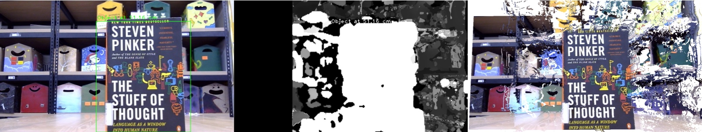

# depth-map

In this project, we will write a program to compute the depth information from 2 stereo systems: one with 1 camera and another with 2 uncalibrated cameras. We also write the calculated distance to the input image and export it together with the depth map to a point cloud file.

There are 3 main files:
- [`notebook.ipynb`](notebook.ipynb): Detailed report of this project
- [`main.py`](main.py): Program that calculate objects's distance from the input left and right images
- [`realtime.py`](realtime.py): Program that calculate objects's distance from the left and right frames of the realtime camera system
- [`debug.ipynb`](debug.ipynb): Program for debugging purposes